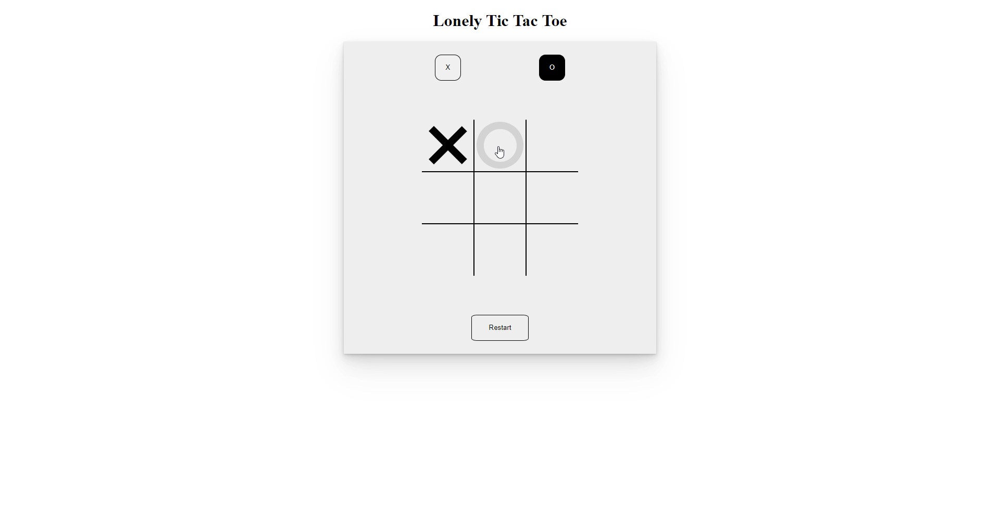

**Tic Tac Toe**

This project is part of The Odin Project Javascript curriculum. This project enables users to play Tic Tac Toe.

The primary focus of this project is to practice JavaScript capabilities through DOM manipulation and creating a functional game. The future goal of this project is to implement a computer player.

**Technologies:**

- Simple HTML, CSS, and JavaScript

**Features:**

- Brings back memories of playing Tic Tac Toe (by yourself)
- No computer player has been implemented (yet!)

**Demo GIF**

